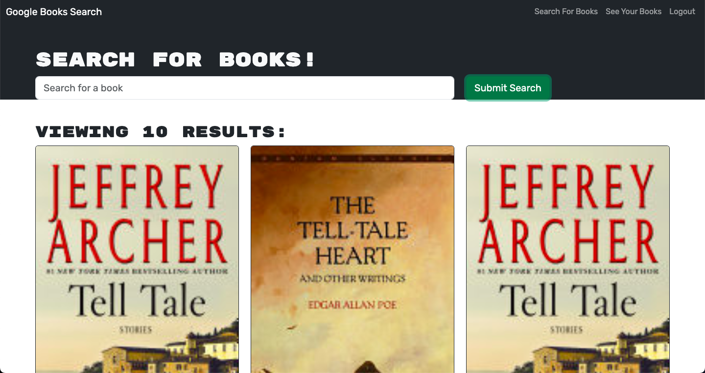

# BookSearchEngine

## Description

Book Search Engine is a full MERN stack application that allows users to search for books using the Google Books API. Users can create an account, login, and save books to their account. Users can also delete books from their account. This application was refactored from a RESTful API to a GraphQL API using Apollo.

## Badge

## Table of Contents

- [Installation](#installation)
- [Usage](#usage)
- [Screenshot](#screenshot)
- [License](#license)
- [Contributing](#contributing)
- [Tests](#tests)
- [Questions](#questions)
- [Badges](#badges)
- [Sources](#sources)

## Installation

run npm install in the base directory to install all dependencies and then run npm run develop to start the server.

## Usage

Either signup or login to the application. Once logged in, you can search for books using the search bar. Once you find a book you like, click the save button to save it to your account. You can view your saved books by clicking the "See Your Books" button. You can delete books from your account by clicking the "Delete this Book" button.

## Screenshot

## Heroku Link

[Link to working example](https://bsearchengine-1319c8ede664.herokuapp.com/)

## License

[GPL](https://api.github.com/licenses/gpl-2.0)

## Contributing

To contribute, please fork the project and create a feature branch.

## Tests

This project has no test instructions

## Questions

Github Username: xclusive36  
Github Profile: [Github Profile](https://github.com/xclusive36/)  
Any additional questions, please reach out to me by email:  
Email: [Email](mailto:xclusive36@gmail.com)

## Sources

- [React](https://reactjs.org/)
- [MongoDB](https://www.mongodb.com/)
- [Mongoose](https://mongoosejs.com/)
- [Node](https://nodejs.org/en/)
- [Express](https://expressjs.com/)
- [Apollo](https://www.apollographql.com/)
- [GraphQL](https://graphql.org/)
- [Google Books API](https://developers.google.com/books)
- [Heroku](https://www.heroku.com/)
- [Bootstrap](https://getbootstrap.com/)
- [React Router](https://reactrouter.com/)
- [bcrypt](https://www.npmjs.com/package/bcrypt)
- [jsonwebtoken](https://www.npmjs.com/package/jsonwebtoken)
- [concurrently](https://www.npmjs.com/package/concurrently)
- [nodemon](https://www.npmjs.com/package/nodemon)